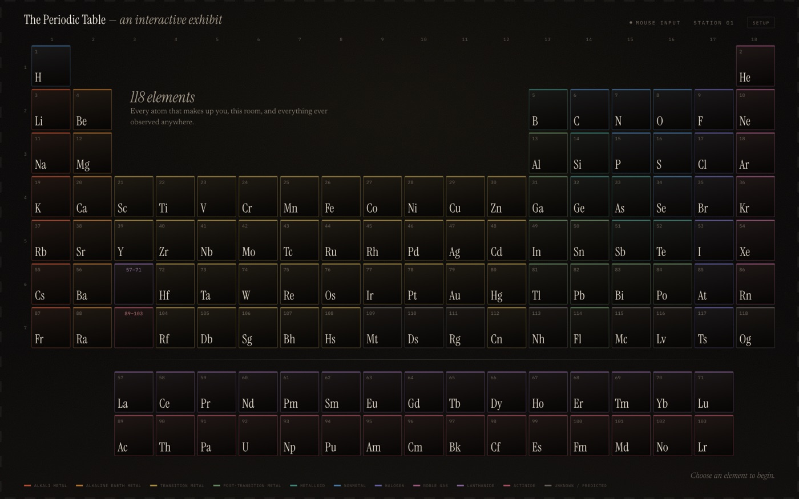
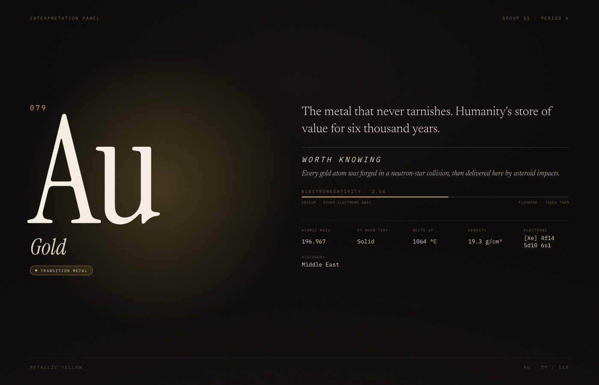

# Periodic Table — Touch Exhibit

A screen-only prototype of a museum periodic-table installation. A visitor chooses an element on
the table display; a second display presents it as an editorial exhibit label; a virtual
addressable LED strip around the screen edge ripples outward from the cell that was pressed.

Two input drivers produce identical behaviour: a mouse, and a webcam hand tracker (MediaPipe)
where you point with your index finger and pinch to select.



_The table display. Hovering an element illuminates its whole group and period; the readout in the
grid's empty quadrant repeats the current element, because a finger occludes the cell it presses._



_The second display, as an editorial exhibit label. Every scalar sits on a named scale rather than
appearing as a bare number._

```bash
npm install
npm run dev          # http://localhost:5173/table  and  /info
npm test             # 73 tests
npm run build
```

Open `/table`, then use **Setup → Open info display** and drag that window to the second monitor.

## Documentation

| Document                                                       | For                                                              |
| -------------------------------------------------------------- | ---------------------------------------------------------------- |
| [`CONTRIBUTING.md`](CONTRIBUTING.md)                           | Picking this up as a teammate. A fifteen-minute tour.            |
| [`CLAUDE.md`](CLAUDE.md)                                       | Invariants and conventions, written for AI collaborators.        |
| [`docs/decisions.md`](docs/decisions.md)                       | Why things are the way they are, and what would change our mind. |
| [`docs/hardware-translation.md`](docs/hardware-translation.md) | What each part becomes on the real installation.                 |
| [`docs/demo-runbook.md`](docs/demo-runbook.md)                 | Running this live: sequence, talking points, recovery.           |
| [`docs/how-this-was-built.md`](docs/how-this-was-built.md)     | The process, including the wrong turns.                          |
| [`docs/design-spec.md`](docs/design-spec.md)                   | The original design specification.                               |
| [`docs/implementation-plan.md`](docs/implementation-plan.md)   | The task-by-task build plan that was executed.                   |

## What this is proving

The intended installation is a **projected surface selected by mid-air hand gesture**, with physical
WS2812-class LEDs around the display edge and a mouse as the fallback input. Hand tracking is the
shipping sensor, not a stand-in — which is why it is hardened rather than sketched.

The same code also serves a **commercial touchscreen** through a `TouchDriver` implementing the same
interface. Supporting both is the point: development and demos run on a laptop with a mouse, the
installation runs on a camera, and a test asserts the two produce identical event sequences.

That hardware does not exist yet, so this prototype exists to make the eventual port _boring_. Three
seams are held deliberately narrow:

| Seam             | Now                                               | Later                                       |
| ---------------- | ------------------------------------------------- | ------------------------------------------- |
| **Input**        | `MouseInteractionSource`, `HandInteractionSource` | the same, plus `TouchDriver` for a panel    |
| **Transport**    | `BrowserEventBus` over `BroadcastChannel`         | WebSocket to an authoritative local process |
| **Light output** | 120 virtual pixels rendered as DOM segments       | serial frames to an LED controller          |

Everything gesture-shaped stops at the driver boundary. No MediaPipe landmark ever reaches the
interaction rules, the display, or the light layer — the only thing that crosses is a
`PointerSample` in normalized table space, which is exactly what a touch driver would emit.

The light model is a **linear array of N addressable pixels addressed by normalized arc length**,
not ad-hoc CSS animation. An effect never contains an LED index, so the same effect maps onto a
real strip of a different length.

## Architecture

```
src/domain/      pure rules — no browser, no React
  types.ts         the contracts every layer shares
  config.ts        every gesture threshold, in one place
  elementLayout.ts canonical 18-column grid + hit test (renderer reads the same numbers)
  interaction.ts   idle → hover → armed → confirmed → cooldown state machine
  calibration.ts   four-point homography, camera space → table space
src/data/        118 elements, generated and committed
src/policy/      category → colour, shared by both displays and the lights
src/adapters/    browser edges: pointer, MediaPipe, camera, event bus
src/ui/          React rendering only
```

`reduceInteraction` is the single path from a pointer sample to an exhibit event. The mouse is not
a React `onClick` shortcut — it goes through the same reducer as the hand, so the two inputs
cannot drift apart. There is a test asserting they emit byte-identical event sequences.

### Deliberate constraints

- **Colour never carries meaning alone.** Every category is also printed as text, on every surface.
- **Commit is debounced per cell** (1,000 ms) rather than globally, so a visitor mashing twelve
  different elements gets twelve responses.
- **Validated at the boundary.** A malformed cross-window message is dropped silently. An exhibit
  does not show error dialogs to visitors.
- **The table's focus card** repeats the current element in the grid's empty quadrant, because a
  finger occludes the cell it is pressing and everything just below it.
- **Camera failure is not exhibit failure.** Denied permission, missing camera, model load failure,
  and lost tracking all degrade to a fully working mouse exhibit.

## Hand tracking

Optional, and off until enabled in the Setup drawer.

- Pointer: index fingertip (landmark 8), un-mirrored, exponentially smoothed.
- Selection: pinch distance ÷ wrist-to-knuckle span, so it is scale- and distance-invariant with
  no calibration. Engage at `0.28`, release at `0.38` — hysteresis, so it cannot flicker.
- **Default mapping:** the central region of the camera frame maps to the whole table, so hand
  tracking works the moment the camera starts. Calibration is a refinement, never a gate.
- **Corner calibration:** hold a fingertip on each of four markers; the captured camera-space
  points solve a projective transform into table space, correcting for an off-axis camera. The
  dwell captures the _mean_ of the whole hold rather than the sample that started it, and forgives
  a brief wobble instead of restarting — an unsupported hand always drifts.
- **Validated before use:** a capture that is too small, taken out of order, or self-crossing still
  solves to a transform, so the quadrilateral is checked for area, convexity, and winding, and
  rejected with a reason. Nothing is persisted until the operator has watched the marker track a
  finger and confirmed it. A stored calibration whose camera or geometry no longer matches falls
  back to the default region rather than being applied anyway.
- WASM and the 7.8 MB model are vendored into `public/mediapipe`, so the demo needs no network.

Tune anything in `src/domain/config.ts`.

## Out of scope, on purpose

Dwell selection, multi-hand input, nine-point calibration, event replay, WebSocket/MQTT transports,
and real LED control. Each has a seam waiting for it; none is needed to prove the interaction.
`docs/decisions.md` records why each was deferred rather than dismissed.

A display that opens or reloads mid-session does recover: it broadcasts `requestState` and the
table re-announces the current selection. That is a handshake, not an authoritative server — if no
table is open, the display stays in its attract state, which is the correct thing to show.

## Regenerating the dataset

`src/data/elements.json` is generated and committed. To rebuild it from the source dataset plus
the authored exhibit copy:

```bash
npm run data:build
```

The generator asserts 118 records, no grid collisions, and copy present for every element.
